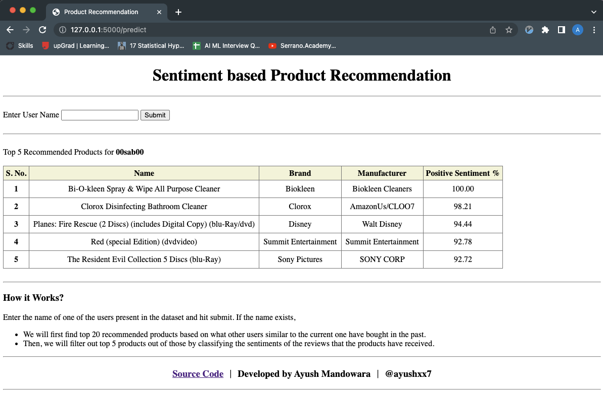

# Sentiment Based Product Recommendation System

1. Data sourcing and sentiment analysis
1. Building a recommendation system
1. Improving the recommendations using the sentiment analysis model
1. Deploying the end-to-end project with a user interface

## App Live on `Heroku`
- [App Link](https://product-recommendation97.herokuapp.com/)

## Screenshot

## Assets

| Filename             | What it is                                              | Type              |
|----------------------|---------------------------------------------------------|-------------------|
| mnb.gz               | Sentiment Classification Model (Multinomal Naive Bayes) | sklearn model     |
| dataset.gz           | The training dataset for User Recommendation model      | pandas dataframe  |
| user_final_rating.gz | User based Product Recommendation Engine                | pandas dataframe  |
| vectorizer.gz        | Vectorizer for converting product reviews to vectors    | TF-IDF Vectorizer |
| app.py               | Flask App for providing prediction endpoint             | python file       |
| model.py             | Product recommendations are generated from this file    | python file       |
| capstone.ipynb       | jupyter notebook used for EDA and model building        | jupyter notebook  |
| templates/index.html | frontend code to get user input and display predictions | HTML file         |

## Source Code on `GitHub`
- [GitHub Link](https://github.com/ayushxx7/SentimentBasedProductRecommendationSystem)

### Dataset 
[Dataset Link](https://cdn.upgrad.com/uploads/production/c2504c0d-6080-4e1e-8d4c-852b3e68a0ed/sample30.csv)

This dataset consists of 30,000 reviews for more than 200 different products. The reviews and ratings are given by more than 20,000 users. 

The description of each column is provided in atrribute description CSV.

### Task 1
Build an ML model to get the sentiments corresponding to the users' reviews and ratings for multiple products.

#### Steps
1. Exploratory data analysis
1. Data cleaning
1. Text preprocessing
1. Feature extraction
1. Training a text classification model

### Task 2

Building a recommendation system

1. User-based recommendation system
2. Item-based recommendation system

### Task 3

Recommend 20 products that a user is most likely to purchase based on the ratings. 

### Task 4 

Improving the recommendations using the sentiment analysis model

Once you recommend 20 products to a particular user using the recommendation engine, you need to filter out the 5 best products based on the sentiments of the 20 recommended product reviews. 

In this way, you will get an ML model (for sentiments) and the best-suited recommendation system.

### Task 5

Deployment of this end to end project with a user interface using Flask and Heroku

1. Take any of the existing usernames as input.
1. Create a submit button to submit the username.
1. Once you press the submit button, it should recommend 5 products based on the entered username.

## Assumption

Assumption: No new users or products will be introduced or considered when building or predicting from the models built.
